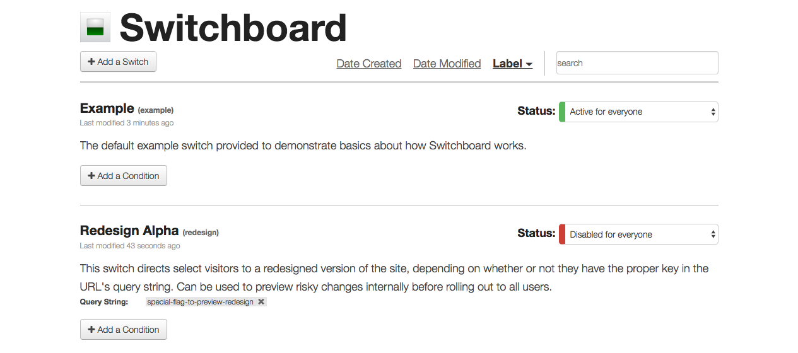

[](https://travis-ci.org/switchboardpy/switchboard)
[](https://codecov.io/gh/switchboardpy/switchboard)


Switchboard
===========

Switchboard is a Python WSGI app that makes it easy to [toggle
features](https://en.wikipedia.org/wiki/Feature_toggle) in
a variety of Python web frameworks. Created to enable
[A/B](https://www.optimizely.com/optimization-glossary/ab-testing/) and [user
testing](https://www.experienceux.co.uk/faqs/what-is-usability-testing/)
at [SourceForge](https://sourceforge.net/), it features an easy-to-use admin
dashboard with powerful conditions for activating a particular feature.



What follows is an abbreviated version of [Switchboard's full
documentation](http://switchboard.readthedocs.io/).

## Getting Started

Want to use Switchboard in your application? Keep reading. Interested in
developing on Switchboard or running a small example locally? Take a
look at the [Development](#development) section.

### Installing

Install Switchboard and its dependencies using pip:

```
pip install switchboard
```

### Setup

Next, embed Switchboard and its admin UI within the application.
Framework-specific details can be found in [Switchboard's
documentation](http://switchboard.readthedocs.io/en/stable/user-documentation.html#installation).

### Using Switches

Switchboard's basic unit is a switch. Every switch has a unique key
associated with it and is either active (on) or inactive (off), so using
it in code is simple:

```
>>> from switchboard import operator
>>> operator.is_active('foo')
False
```

In this case we checked to see if the "foo" switch was active. By
default, Switchboard will auto-create any switches that don't already
exist, such as "foo". Auto-created switches default to an inactive
state. This just scratches the surface; [there's so much more that a switch can
do](http://switchboard.readthedocs.io/en/stable/user-documentation.html#using-switches).

## Development

These instructions cover setting Switchboard up locally for development and
testing purposes. See installing for notes on how to use Switchboard within a
web application.

### Prerequisites

* Virtualenv: `$ sudo easy_install virtualenv`

### Bootstrapping

1. Make a virtualenv workspace: `$ virtualenv --no-site-packages .venv`
1. Activate the virtualenv:     `$ source .venv/bin/activate`
1. Install all dependencies:    `$ make install`

### Running the Example App

Switchboard includes an
[example](https://github.com/switchboardpy/switchboard/blob/master/example/server.py)
application, which is handy both for doing development and for taking it for a
test drive in a very simple environment. It also provides an example of
setting Switchboard up to run within a
[Bottle](https://www.fullstackpython.com/bottle.html)-based application.

To run:

```
$ make example
```

At this point a very simple application is now running at
`http://localhost:8080` and the admin UI is accessible at
`http://localhost:8080/_switchboard/`. The application has one switch
(`example`) and outputs text that tells you whether the switch is active.

### Running Tests

Switchboard includes both unit tests and functional tests of the admin
dashboard, using the example application.

To run the unit tests:

```
$ make test
```

To run the functional tests:

```
$ make functional-test
```

### Releasing

To distribute a new release of Switchboard:

1. Update the version in `setup.py`, following [Semantic
   Versioning](http://semver.org).
1. Cut the release:
```
$ make release
```

### Versioning

We use [SemVer](http://semver.org/) for versioning. For the versions available,
see the [tags on this repository](https://github.com/switchboardpy/switchboard/tags).


## Contributing

Please read [CONTRIBUTING.md](CONTRIBUTING.md) for details on our code of
conduct, and the process for submitting pull requests to us.

## Authors

* **Kyle Adams** - *Initial work* - [kadams54](https://github.com/kadams54)

See also the list of
[contributors](https://github.com/switchboardpy/switchboard/contributors) who
participated in this project.

## License

This project is licensed under the Apache License - see the [LICENSE](LICENSE)
file for details.

## Acknowledgments

Switchboard began life as a port of [Disqus'](https://disqus.github.io/)
[Gargoyle](https://github.com/disqus/gargoyle), a feature flipper
for [Django](https://www.djangoproject.com/).
[David Cramer's](https://twitter.com/zeeg) [Pycon](https://us.pycon.org/2018/)
lightning talk on Gargoyle had me drooling for that same feature flipping fun in
non-Django apps.
